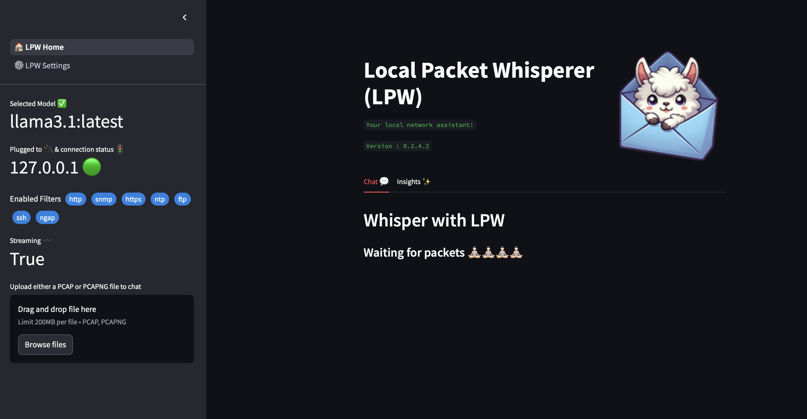

# Local Packet Whisperer (LPW)

A privacy-focused PCAP analysis tool powered by local and cloud LLMs. Chat with your network captures using AI, with support for both Ollama (local) and OpenAI-compatible APIs.



## Features

- **100% Local or Cloud** - Use Ollama for private local analysis or connect to OpenAI-compatible APIs
- **Docker Support** - One-command deployment with docker-compose
- **RAG for Large Files** - Handle 500MB+ PCAP files efficiently with session-based vector search
- **Streamlit UI** - Clean, intuitive web interface for packet analysis
- **Network-Ready** - Connect to LLM servers over your network
- **Multiple LLM Support** - Compatible with Ollama, OpenAI, and other OpenAI-compatible endpoints

## Quick Start

**Prerequisites:** [Docker](https://docs.docker.com/get-docker/) and [Docker Compose](https://docs.docker.com/compose/install/)

```bash
git clone https://github.com/NotYuSheng/local-packet-whisperer.git
cd local-packet-whisperer
cp example.env .env  # Define llm enndpoint
docker compose up -d
```

Access the application at [http://localhost:8501](http://localhost:8501)

To stop:
```bash
docker compose down
```

## Architecture & Approach

### Current Implementation: RAG (Experimental)

LPW currently uses RAG (Retrieval Augmented Generation) for analyzing PCAP files:
- Packets are grouped and embedded into a vector database (ChromaDB)
- User questions trigger semantic search to retrieve relevant packet groups
- Retrieved packets are sent to the LLM for analysis

**Limitations observed:**
- Semantic search may not be ideal for structured packet data
- Citation accuracy can be inconsistent
- LLM may hallucinate packet ranges beyond retrieved data

### Future Direction: Deterministic Agentic Approach

A more promising approach would be:

1. **LLM writes Wireshark display filters** based on user questions
2. **Apply filters deterministically** to extract relevant packet subset
3. **Analyze filtered packets** with full context and accuracy

**Benefits:**
- ✅ Precise, deterministic filtering using proven Wireshark syntax
- ✅ No semantic search ambiguity
- ✅ Accurate citations (actual filtered packets)
- ✅ Leverages existing packet analysis tooling

**Example workflow:**
```
User: "Show me all HTTP POST requests to example.com"
  ↓
LLM generates: http.request.method == "POST" && http.host == "example.com"
  ↓
Filter applied → Subset of packets
  ↓
LLM analyzes filtered subset → Accurate response
```

This agentic approach would be more suitable for the structured nature of network packets.

**Inspiration: Demisto PCAP Analysis Playbook**

The [Demisto PCAP Analysis playbook](https://github.com/demisto/content/blob/master/Packs/PcapAnalysis/Playbooks/playbook-PCAP_Parsing_And_Indicator_Enrichment_README.md) demonstrates a superior approach:
- Systematic parsing and indicator extraction
- File carving for forensic analysis
- Deterministic search/filtering workflows
- Multi-stage enrichment pipeline

A similar multi-agent system for LPW could:
1. **Parser Agent** - Extract structured data (IPs, ports, protocols)
2. **Filter Agent** - Generate and apply Wireshark filters
3. **Analysis Agent** - Examine filtered subsets with full context
4. **Enrichment Agent** - Add threat intelligence, WHOIS, etc.

This would provide deterministic, auditable analysis vs. probabilistic RAG retrieval.

## Contributions

Contributions are welcome! Feel free to:
- Report bugs via [Issues](https://github.com/NotYuSheng/local-packet-whisperer/issues)
- Submit pull requests with bug fixes or new features
- Suggest improvements or new features

## License

This project is licensed under the MIT License - see the [LICENSE](LICENSE) file for details.

## Credits

This is fork with additions including Docker support, RAG implementation, and OpenAI API compatibility.

Original project: [local-packet-whisperer](https://github.com/kspviswa/local-packet-whisperer) by [kspviswa](https://github.com/kspviswa)
